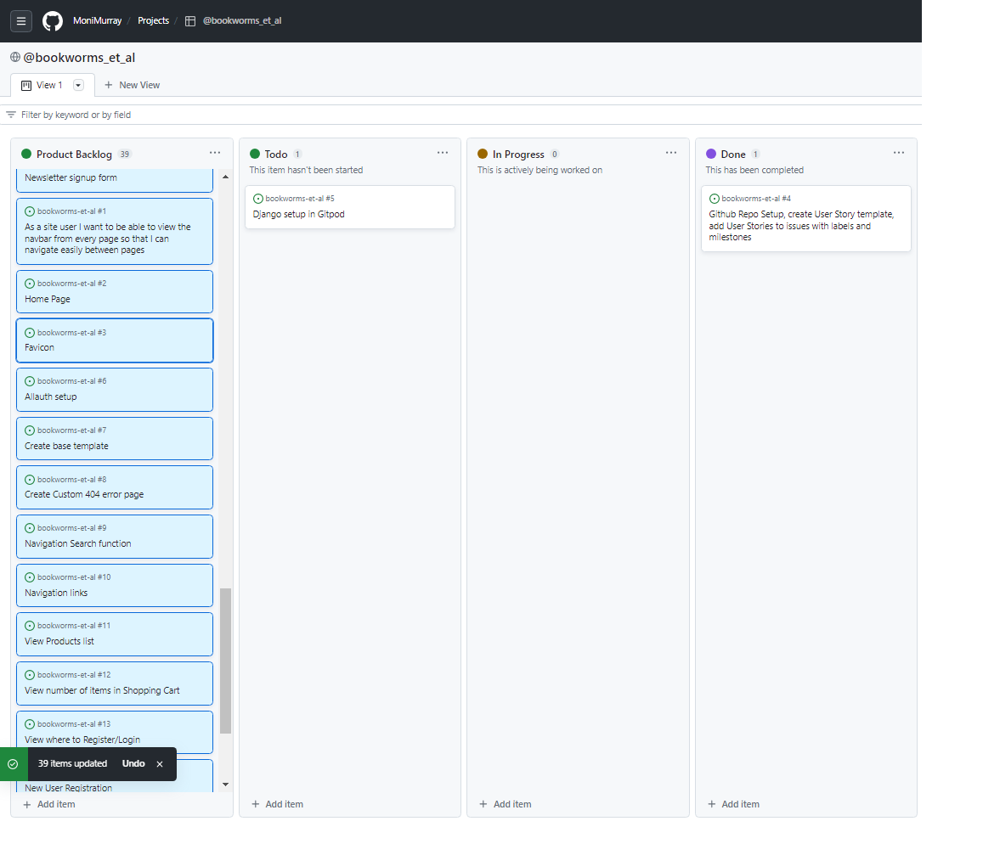
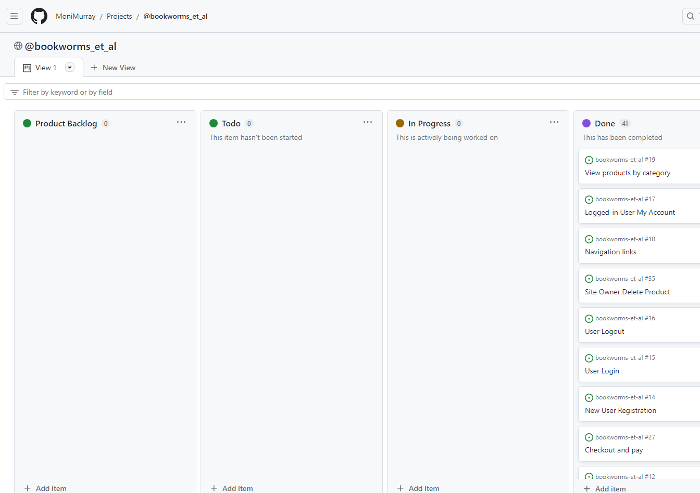

# BOOKWORMS et al

## Agile Methodology Overview

I have used GitHub Projects in the Agile development of my project. I created a new project in the Projects tab of my repository, named '@bookworms_et_al'. Within this Project I used a Kanban Board to track each User Story as I incrementally developed the MVP of the project.

# CONTENTS
1. [User Stories](#us)

2. [User Acceptance Criteria](#uac)

3. [MoSCoW Prioritisation](#moscow)

4. [User Story Tasks](#ust)

## User Stories

A user story is a small, self-contained unit of development. They are used to map the development progress of the project via a Kanban board. I have used these units in my Project to incrementally achieve the MVP.

Each user story is based on a bespoke user story Template which is created in the Settings tab of my GitHub repository.

| User Story Template                                        |
| ---------------------------------------------------------- |
| As a (role) I can (capability) so that (received benefit). |

Each User Story extends from the Template and is created in the Issues tab of my Github repository.

User Stories have been grouped and categorised into Epics using bespoke 'labels', where appropriate, and then assigned to the project named '@bookworms_et_al' where they are used to structure the development of the MVP of my project.

| User Story ID                   | As a (role)           | I want to be able to (capacity)                                    | so that I can (received benefit)                                                                                         |
| ------------------------------- | --------------------- | ------------------------------------------------------------------ | ------------------------------------------------------------------------------------------------------------------------ |
|                                 |                       |                                                                    |                                                                                                                          |
| Home Page                       |
|                                 | first time site user  | see a colourful, robust and intuitive landing page                 | understand what the site sells and be encouraged to make a purchase                                                      |
|                                 | site user             | see an intuitive favicon on the site name in the browser           | understand the website's purpose                                                                                         |
|                                 |                       |                                                                    |                                                                                                                          |
|                                 |                       |                                                                    |                                                                                                                          |
| Viewing and Navigation          |
|                                 | site user             | view the navbar from every page                                    | navigate easily between pages                                                                                            |
|                                 | site user             | search by category or author                                       | so that I can find products that interest me                                                                             |
|                                 | site user             | navigate through pages quickly                                     | view content seamlessly without page refresh                                                                             |
|                                 | site user             | view a list of products                                            | select one or some to purchase                                                                                           |
|                                 | site user             | view the number of items in my shopping cart                       | so I know how many items I have selected for purchase                                                                    |
|                                 | site user             | See where the Register and Login options are                       | I can Register/Login                                                                                                     |
|                                 |                       |                                                                    |                                                                                                                          |
| Registration and Authentication |
|                                 | site user             | easily register for a personal user account                        | have a personal account and be able to view my account content, previous orders and save my billing and shipping details |
|                                 | site user             | login to my account                                                | access, view and edit my personal account information                                                                    |
|                                 | site user             | logout of my account                                               | log out and secure my personal account information when not using the store                                              |
|                                 | logged in user        | edit my personal and shipping details                              | keep my account profile up to date                                                                                       |
|                                 | logged in user        | rate a product I have purchased                                    | contribute to the rating of products on the site                                                                         |
|                                 | logged in user        | comment on a product I have purchased                              | contribute to the rating of products on the site                                                                         |
|                                 |                       |                                                                    |                                                                                                                          |
| Sorting and Searching           |
|                                 | site user             | sort the available products                                        | identify highly rated, low/high priced items                                                                             |
|                                 | site user             | view products by category                                          | group products by the category or genre that interests me                                                                |
|                                 | site user             | view products by author                                            | select other works by the same author                                                                                    |
|                                 | site user             | view what I have searched                                          | see whether what I want is available in the store and the number of the search results                                   |
|                                 |                       |                                                                    |                                                                                                                          |
| Purchasing and Checkout         |
|                                 | site user             | add an item to my shopping cart                                    | make a purchase                                                                                                          |
|                                 | site user             | view on screen notifications when I add a product to shopping cart | confirm my action was successful                                                                                         |
|                                 | site user             | select the quantity of the product I want                          | ensure I don't get too many or too few of the product I want                                                             |
|                                 | site user             | view the contents of the shopping cart                             | see the total cost of what I have selected                                                                               |
|                                 | site user             | adjust the quantity of any item in the shopping cart               | increase or decrease the quantity of an item for puchase                                                                 |
|                                 | site user             | delete an item from my shopping cart                               | remove it for puchase                                                                                                    |
|                                 | site user             | checkout and pay                                                   | complete my purchase                                                                                                     |
|                                 | logged in user        | enter my shipping information                                      | checkout quickly and without problems                                                                                    |
|                                 | logged in user        | view an order confirmation after checkout                          | review a summary of my successful purchase                                                                               |
|                                 |                       |                                                                    |                                                                                                                          |
| Payment                         |
|                                 | site user             | enter my card details                                              | pay for my purchase                                                                                                      |
|                                 | site user             | have my payment processed securely                                 | pay for my purchase                                                                                                      |
|                                 |                       |                                                                    |                                                                                                                          |
| Store Owner Product Management  |
|                                 | store owner/admin     | have a secure view of the store's product data                     | protect the security of the data of my store                                                                             |
|                                 | store owner/admin     | add a new product to the site                                      | expand the product offering of the store                                                                                 |
|                                 | store owner/admin     | edit/update an existing item                                       | update product price, description, etc                                                                                   |
|                                 | store owner/admin     | delete an item from the site                                       | remove items no longer being stocked by the store                                                                        |
|                                 | store owner/admin     | reply to comments from logged in users                             | ensure customers feel valued by the owners of the store                                                                  |
|                                 |                       |                                                                    |                                                                                                                          |
| Emails                          |
|                                 | newly registered user | receive a verification email upon registering on the site          | verify my account registration was successful                                                                            |
|                                 | logged in user        | receive a confirmation of purchase email                           | view and keep a record of my confirmed order                                                                             |
|                                 |                       |                                                                    |                                                                                                                          |
| SEO and Marketing               |
|                                 |                       | Create dummy FB page                                               |                                                                                                                          |
|                                 |                       | Add a newsletter signup form to application                        |                                                                                                                          |
|                                 |                       |                                                                    |                                                                                                                          |
|                                 |                       |                                                                    |                                                                                                                          |
| User Feedback                   |
|                                 |                       | All user action must receive feedback                              |                                                                                                                          |
|                                 |                       |                                                                    |

### Problem Statement

- How do I develop an application that provides all this functionality to a user?

| Features/Functionality                                                                               | Problem Statement                                                               | User Story                                                                                                                                                                                                             |
| ---------------------------------------------------------------------------------------------------- | ------------------------------------------------------------------------------- | ---------------------------------------------------------------------------------------------------------------------------------------------------------------------------------------------------------------------- |
|                                                                                                      | How do I develop an application that provides all this functionality to a user? | As a (role) I can (capability) so that (received benefit).                                                                                                                                                             |
| *Setup Tasks*                                                                                          |                                                                                 |                                                                                                                                                                                                                        |
| Github Repo Setup, create User Story template, add User Stories to issues with labels and milestones |                                                                                 |                                                                                                                                                                                                                        |
| Django setup in Gitpod                                                                               |                                                                                 |                                                                                                                                                                                                                        |
| Allauth setup                                                                                        |                                                                                 |                                                                                                                                                                                                                        |
| Create base template                                                                                 |                                                                                 |                                                                                                                                                                                                                        |
| Create 404 error page                                                                                |                                                                                 |                                                                                                                                                                                                                        |
|                                                                                                      |                                                                                 |                                                                                                                                                                                                                        |
| *Home Page*                                                                                            |                                                                                 |                                                                                                                                                                                                                        |
|                                                                                                      |                                                                                 | As a first time site user I want to be able to see a colourful, robust and intuitive landing page so that I can understand what the site sells and be encouraged to make a purchase.                                   |
|                                                                                                      |                                                                                 | As a site user I want to be able to see an intuitive favicon on the site name in the browser so that I can understand the website's purpose                                                                            |
| *Viewing and Navigation*                                                                              |                                                                                 |                                                                                                                                                                                                                        |
|                                                                                                      |                                                                                 | As a site user I want to be able to view the navbar from every page so that I can navigate easily between pages.                                                                                                       |
|                                                                                                      |                                                                                 | As a site user I want to be able to search by category or author so that I can find products that interest me                                                                                                          |
|                                                                                                      |                                                                                 | As a site user I want to be able to navigate through pages quickly so that I can view content seamlessly without page refresh.                                                                                         |
|                                                                                                      |                                                                                 | As a site user I want to be able to view a list of products so that I can select one or some to purchase.                                                                                                              |
|                                                                                                      |                                                                                 | As a site user I want to be able to view the number of items in my shopping cart so I know how many items I have selected for purchase.                                                                                |
|                                                                                                      |                                                                                 | As a site user I want to be able to see where the Register and Login options are so that I can Register/Login.                                                                                                         |
| *Registration and Authentication*                                                                      |                                                                                 |                                                                                                                                                                                                                        |
|                                                                                                      |                                                                                 | As a site user I want to be able to easily register for a personal user account so that I can have a personal account and be able to view my account content, previous orders and save my billing and shipping details |
|                                                                                                      |                                                                                 | As a site user I want to be able to login to my account so that I can access, view and edit my personal account information                                                                                            |
|                                                                                                      |                                                                                 | As a site user I want to be able to logout of my account so that I can log out and secure my personal account information when not using the store.                                                                    |
|                                                                                                      |                                                                                 | As a logged in user I want to be able to edit my personal and shipping details so that I can keep my account profile up to date                                                                                        |
|                                                                                                      |                                                                                 | As a logged in user I want to be able to rate a product I have purchased so that I can contribute to the rating of products on the site                                                                                |
|                                                                                                      |                                                                                 | As a logged in user I want to be able to comment on a product I have purchased so that I can contribute to the rating of products on the site                                                                          |
| *Sorting and Searching*                                                                                |                                                                                 |                                                                                                                                                                                                                        |
|                                                                                                      |                                                                                 | As a site user I want to be able to sort the available products so that I can identify highly rated, low/high priced items                                                                                             |
|                                                                                                      |                                                                                 | As a site user I want to be able to view products by category so that I can group products by the category or genre that interests me.                                                                                 |
|                                                                                                      |                                                                                 | As a site user I want to be able to view products by author so that I can select other works by the same author.                                                                                                       |
|                                                                                                      |                                                                                 | As a site user I want to be able to view what I have searched so that I can see whether what I want is available in the store and the number of the search results.                                                    |
| *Purchasing and Checkout*                                                                              |                                                                                 |                                                                                                                                                                                                                        |
|                                                                                                      |                                                                                 | As a site user I want to be able to add an item to my shopping cart so that I can make a purchase.                                                                                                                     |
|                                                                                                      |                                                                                 | As a site user I want to be able to view on screen notifications when I add a product to shopping cart so that I can confirm my action was successful.                                                                 |
|                                                                                                      |                                                                                 | As a site user I want to be able to select the quantity of the product I want so that I can ensure I don't get too many or too few of the product I want.                                                              |
|                                                                                                      |                                                                                 | As a site user I want to be able to view the contents of the shopping cart so that I can see the total cost of what I have selected.                                                                                   |
|                                                                                                      |                                                                                 | As a site user I want to be able to adjust the quantity of any item in the shopping cart so that I can increase or decrease the quantity of an item for puchase.                                                       |
|                                                                                                      |                                                                                 | As a site user I want to be able to delete an item from my shopping cart so that I can remove it for puchase.                                                                                                          |
|                                                                                                      |                                                                                 | As a site user I want to be able to checkout and pay so that I can complete my purchase.                                                                                                                               |
|                                                                                                      |                                                                                 | As a logged in user I want to be able to enter my shipping information so that I can checkout quickly and securely.                                                                                                    |
|                                                                                                      |                                                                                 | As a logged in user I want to be able to view an order confirmation after checkout so that I can review a summary of my successful purchases.                                                                          |
| *Payment*                                                                                              |                                                                                 |                                                                                                                                                                                                                        |
|                                                                                                      |                                                                                 | As a site user I want to be able to enter my card details so that I can pay for my purchase.                                                                                                                           |
|                                                                                                      |                                                                                 | As a site user I want to be able to have my payment processed securely so that I can pay for my purchase.                                                                                                              |
| *Store Owner Product Management*                                                                       |                                                                                 |                                                                                                                                                                                                                        |
|                                                                                                      |                                                                                 | As the store owner/admin I want to be able to have a secure view of the store's product data so that I can protect the security of the data of my store.                                                               |
|                                                                                                      |                                                                                 | As the store owner/admin I want to be able to add a new product to the site so that I can expand the product offering of the store                                                                                     |
|                                                                                                      |                                                                                 | As the store owner/admin I want to be able to edit/update an existing item so that I can update product price, description, etc.                                                                                       |
|                                                                                                      |                                                                                 | As the store owner/admin I want to be able to delete an item from the site so that I can remove items no longer being stocked by the store.                                                                            |
|                                                                                                      |                                                                                 | As the store owner/admin I want to be able to reply to comments from logged in users so that I can ensure customers feel valued by the owners of the store.                                                            |
| *Emails*                                                                                               |                                                                                 |                                                                                                                                                                                                                        |
|                                                                                                      |                                                                                 | As a newly registered user I want to be able to receive a verification email upon registering on the site so that I can verify my account registration was successful.                                                 |
|                                                                                                      |                                                                                 | As a logged in user I want to be able to receive a confirmation of purchase email so that I can view and keep a record of my confirmed order                                                                           |
| *SEO and Marketing*                                                                                    |                                                                                 |                                                                                                                                                                                                                        |
|                                                                                                      |                                                                                 | Create dummy FB page                                                                                                                                                                                                   |
|                                                                                                      |                                                                                 | Add a newsletter signup form to application                                                                                                                                                                            |
| *User Feedback*                                                                                        |                                                                                 |                                                                                                                                                                                                                        |
|                                                                                                      |                                                                                 | All user action must receive feedback                                                                                                                                                                                  |

This is a screenshot of the Kanban board in Projects at different stages of the development process.

## User Acceptance Criteria

I created a set of Acceptance Criteria for each User Story to set out a clear objective of what to achieve to complete each story. The objective is broken down into steps, and in that way is a clear and measurable way of confirming the work on that user story is complete and it can be moved to 'Done':

User Story	Acceptance Criteria

| User Story                                                                                                                                                                                                             | Acceptance Criteria                                                                                                                                                                                                                                                                                                                                             |
| ---------------------------------------------------------------------------------------------------------------------------------------------------------------------------------------------------------------------- | --------------------------------------------------------------------------------------------------------------------------------------------------------------------------------------------------------------------------------------------------------------------------------------------------------------------------------------------------------------- |
| As a (role) I can (capability) so that (received benefit).                                                                                                                                                             |                                                                                                                                                                                                                                                                                                                                                                 |
|                                                                                                                                                                                                           |                                                                                                                                                                                                                                                                                                                                                                 |
| As a first time site user I want to be able to see a colourful, robust and intuitive landing page so that I can understand what the site sells and be encouraged to make a purchase.                                   | \- implement fully functioning, fully responsive, grid-based landing page \- from the layout, typography and imagry, intuit website's purpose                                                                                                                                                                                                                |
| As a site user I want to be able to see an intuitive favicon on the site name in the browser so that I can understand the website's purpose                                                                            | \- view a favicon on the browser with the website title                                                                                                                                                                                                                                                                                                         |
|                                                                                                                                                                                                                        |                                                                                                                                                                                                                                                                                                                                                                 |
| As a site user I want to be able to view the navbar from every page so that I can navigate easily between pages.                                                                                                       | \- implement nav view accross all pages \- update view of navbar to reflect user login                                                                                                                                                                                                                                                                       |
| As a site user I want to be able to search by category or author so that I can find products that interest me                                                                                                          | \- implement search function in nav bar \- search by category, author and see list of returned results                                                                                                                                                                                                                                                       |
| As a site user I want to be able to navigate through pages quickly so that I can view content seamlessly without page refresh.                                                                                         | \- implement links for each page in nav bar \- all pages on the site can be reached by a link from each other page                                                                                                                                                                                                                                           |
| As a site user I want to be able to view a list of products so that I can select one or some to purchase.                                                                                                              | \- all products can be viewed in a responsive grid \- clicking 'Add to Cart' button should add the item to the Shopping Cart                                                                                                                                                                                                                                 |
| As a site user I want to be able to view the number of items in my shopping cart so I know how many items I have selected for purchase.                                                                                | \- view the number of the items in the Shopping Cart over the Shopping Cart icon                                                                                                                                                                                                                                                                                |
| As a site user I want to be able to see where the Register and Login options are so that I can Register/Login.                                                                                                         | \- view options to Register or Login to My Account in nav bar                                                                                                                                                                                                                                                                                                   |
|                                                                                                                                                                                                                        |                                                                                                                                                                                                                                                                                                                                                                 |
| As a site user I want to be able to easily register for a personal user account so that I can have a personal account and be able to view my account content, previous orders and save my billing and shipping details | \- Register link launches User Registration page to anonymous users \- Allauth default registration form loads \- New user can submit the completed form \- Newly registered user receives user feedback on successfully registering                                                                                                                   |
| As a site user I want to be able to login to my account so that I can access, view and edit my personal account information                                                                                            | \- Login link launches User Login page to anonymous users                                                                                                                                                                                                                                                                                                       |
| As a site user I want to be able to logout of my account so that I can log out and secure my personal account information when not using the store.                                                                    | \- Logout link logs the User out                                                                                                                                                                                                                                                                                                                                |
| As a logged in user I want to be able to edit my personal and shipping details so that I can keep my account profile up to date                                                                                        | \- Access My Account information via nav bar \- Edit My Account personal details \- Save changes to My Account personal details \- See a list of previous purchases                                                                                                                                                                                    |
| As a logged in user I want to be able to rate a product I have purchased so that I can contribute to the rating of products on the site                                                                                |                                                                                                                                                                                                                                                                                                                                                                 |
| As a logged in user I want to be able to comment on a product I have purchased so that I can contribute to the rating of products on the site                                                                          |                                                                                                                                                                                                                                                                                                                                                                 |
|                                                                                                                                                                                                                        |                                                                                                                                                                                                                                                                                                                                                                 |
| As a site user I want to be able to sort the available products so that I can identify highly rated, low/high priced items                                                                                             | \- Sort product view by Highly rated, or by price low/high, high/low                                                                                                                                                                                                                                                                                            |
| As a site user I want to be able to view products by category so that I can group products by the category or genre that interests me.                                                                                 | \- User can click on Category title on Nav bar to view a list of items available to purchase in that category \- User can use Search bar to search by category to view a list of items available to purchase in that category                                                                                                                                |
| As a site user I want to be able to view products by author so that I can select other works by the same author.                                                                                                       | \- User can use Search bar to search by Author to view a list of items available to purchase by that Author                                                                                                                                                                                                                                                     |
| As a site user I want to be able to view what I have searched so that I can see whether what I want is available in the store and the number of the search results.                                                    | \- User can Search the store for items available to purchase by Category, Title or Author \- User's search response is a list of items, or a message 'Nothing turned up'                                                                                                                                                                                     |
|                                                                                                                                                                                                                        |                                                                                                                                                                                                                                                                                                                                                                 |
| As a site user I want to be able to add an item to my shopping cart so that I can make a purchase.                                                                                                                     | \- User can click on 'Add to Cart' button on any product item \- Item is added to the User's Shopping Cart session                                                                                                                                                                                                                                           |
| As a site user I want to be able to view on screen notifications when I add a product to shopping cart so that I can confirm my action was successful.                                                                 | \- User see's an on-screen message beside the Shopping Cart that a new item was added to the Cart \- User can click on the 'x' on the message to close the message, controlling the actions                                                                                                                                                                  |
| As a site user I want to be able to select the quantity of the product I want so that I can ensure I don't get too many or too few of the product I want.                                                              | \- User can increase and decrease the selected number of an item by the number picker on each product item on the Product template page                                                                                                                                                                                                                         |
| As a site user I want to be able to view the contents of the shopping cart so that I can see the total cost of what I have selected.                                                                                   | \- User can click on the Shopping Cart icon to view their Shopping Cart items \- User can see each selected item, and see the cost of their shopping                                                                                                                                                                                                      |
| As a site user I want to be able to adjust the quantity of any item in the shopping cart so that I can increase or decrease the quantity of an item for puchase.                                                       | \- User can increase and decrease the lineitem quantity of any item in the Shopping Cart between 1-5                                                                                                                                                                                                                                                            |
| As a site user I want to be able to delete an item from my shopping cart so that I can remove it for puchase.                                                                                                          | \- User can remove a lineitem from the shopping cart                                                                                                                                                                                                                                                                                                            |
| As a site user I want to be able to checkout and pay so that I can complete my purchase.                                                                                                                               | \- click 'checkout' button in the shopping cart to launch checkout screen \- view checkout template page pre-loaded with Shopping Cart contents, sub-total, shipping cost, and Total \- view shipping details form on checkout template page pre-filled with shipping address data if user has made a previous purchase, blank if making a first purchase |
| As a logged in user I want to be able to enter my shipping information so that I can checkout quickly and securely.                                                                                                    | \- User can input their shipping information \- Returning users details are autofilled from their My Account shipping data                                                                                                                                                                                                                                   |
| As a logged in user I want to be able to view an order confirmation after checkout so that I can review a summary of my successful purchases.                                                                          | \- User can view a brief order confirmation on screen following successful purchase                                                                                                                                                                                                                                                                             |
|                                                                                                                                                                                                                        |                                                                                                                                                                                                                                                                                                                                                                 |
| As a site user I want to be able to enter my card details so that I can pay for my purchase.                                                                                                                           | \- Using Stripe, User can enter valid card details to make a purchase on the website                                                                                                                                                                                                                                                                            |
| As a site user I want to be able to have my payment processed securely so that I can pay for my purchase.                                                                                                              | \- Using Stripe, User can enter valid card details and authorise a valid, and a secure purchase on the website                                                                                                                                                                                                                                                  |
|                                                                                                                                                                                                                        |                                                                                                                                                                                                                                                                                                                                                                 |
| As the store owner/admin I want to be able to have a secure view of the store's product data so that I can protect the security of the data of my store.                                                               | \- Store owner security \- Restrict accessibility to only superuser                                                                                                                                                                                                                                                                                          |
| As the store owner/admin I want to be able to add a new product to the site so that I can expand the product offering of the store                                                                                     | \- see a secure 'Add Product' button \- launch new, blank, 'Add Product' form to complete                                                                                                                                                                                                                                                                    |
| As the store owner/admin I want to be able to edit/update an existing item so that I can update product price, description, etc.                                                                                       | \- Store owner/admin can click on Edit link on Product page \- Store owner/admin can edit not-unique Product fields and save to database                                                                                                                                                                                                                     |
| As the store owner/admin I want to be able to delete an item from the site so that I can remove items no longer being stocked by the store.                                                                            | \- Store owner/admin can click on Delete link on Product page \- Store owner/admin can Delete Product from the database                                                                                                                                                                                                                                      |
| As the store owner/admin I want to be able to reply to comments from logged in users so that I can ensure customers feel valued by the owners of the store.                                                            | \- Store owner/admin can respond to customer comments on Store products                                                                                                                                                                                                                                                                                         |
|                                                                                                                                                                                                                        |                                                                                                                                                                                                                                                                                                                                                                 |
| As a newly registered user I want to be able to receive a verification email upon registering on the site so that I can verify my account registration was successful.                                                 | \- On registering a User can verify their email address \- A newly registered User can see a feedback message whether they were successful or otherwise                                                                                                                                                                                                      |
| As a logged in user I want to be able to receive a confirmation of purchase email so that I can view and keep a record of my confirmed order                                                                           | \- On making a purchase from the store a User can receive an order confirmation to their email address                                                                                                                                                                                                                                                          |
|                                                                                                                                                                                                                        |                                                                                                                                                                                                                                                                                                                                                                 |
| Create dummy FB page                                                                                                                                                                                                   |                                                                                                                                                                                                                                                                                                                                                                 |
| Add a newsletter signup form to application                                                                                                                                                                            |                                                                                                                                                                                                                                                                                                                                                                 |
|                                                                                                                                                                                                                        |                                                                                                                                                                                                                                                                                                                                                                 |
| All user action must receive feedback                                                                                                                                                                                  |

## MoSCoW Prioritisation

### Prioritisation of User Stories

I have used MoSCoW Prioritisation to assign a priority level to the User Stories of the Project. 'MoSCoW' is an acronym for 'Must have', 'Should have', 'Could have, 'Will not have' and represent the prioritisation level applied to User Stories during this iteration of production. For the purpose of this project, 'an iteration' represents this project's lifecycle up to submission.

- Must Have - these User Stories are non-negotiable and represent the core functionality of the Project. As such, they are guaranteed to be delivered. 'Must have' features of this project are the Responsive front-end design, User Registration and Authentication, and CRUD. This represents approximately 60% of the effort planned for the project overall.

- Should Have and Could Have - Should have/Could have can be grouped together as being important aspects of the Project adding significant value, but as they are not vital they should each represent approximately 20% of the effort planned for the project.

- Won't Have - User Stories marked as Won't have may be included as features in future iterations of my Project, but will not be delivered in this iteration.

User Story	MOSCOW

TABLE

## User Story Tasks

I have used the acceptance criteria steps to create user story tasks to facilitate the execution of each User Story. Once these tasks for each User Story are complete and tested, the User Story is finished and is assigned as 'Done' in the Project Kanban.

Acceptance Criteria	User Story Task

| User Story                                                                                                                                                                                                             | Acceptance Criteria                                                                                                                                                                                                                                                                                                                                             | User Story Task                                                                                                                                                                                                                                                                                                                                                                                   |
| ---------------------------------------------------------------------------------------------------------------------------------------------------------------------------------------------------------------------- | --------------------------------------------------------------------------------------------------------------------------------------------------------------------------------------------------------------------------------------------------------------------------------------------------------------------------------------------------------------- | ------------------------------------------------------------------------------------------------------------------------------------------------------------------------------------------------------------------------------------------------------------------------------------------------------------------------------------------------------------------------------------------------- |
| As a (role) I can (capability) so that (received benefit).                                                                                                                                                             |                                                                                                                                                                                                                                                                                                                                                                 |                                                                                                                                                                                                                                                                                                                                                                                                   |
|                                                                                                                                                                                                                        |                                                                                                                                                                                                                                                                                                                                                                 |                                                                                                                                                                                                                                                                                                                                                                                                   |
| As a first time site user I want to be able to see a colourful, robust and intuitive landing page so that I can understand what the site sells and be encouraged to make a purchase.                                   | \- implement fully functioning, fully responsive, grid-based landing page \- from the layout, typography and imagry, intuit website's purpose                                                                                                                                                                                                                | Task 1: Build a Home page app Task 2: Create the Home page template Task 3: Add the Home page url to the main url.py Task 4: Add grid based bootstrap to layout the products in a responsive way Task 5. Include a site image which conveys the business purpose, ie. bookstore Task 6: ...                                                                                        |
| As a site user I want to be able to see an intuitive favicon on the site name in the browser so that I can understand the website's purpose                                                                            | \- view a favicon on the browser with the website title                                                                                                                                                                                                                                                                                                         | Task 1: Choose an image to use as a favicon Task 2: Go to [favicon.io](http://favicon.io/) website, drag in image and download zip file containing png files of differing sized images Task 3: Import links to base.html                                                                                                                                                                 |
|                                                                                                                                                                                                                        |                                                                                                                                                                                                                                                                                                                                                                 |                                                                                                                                                                                                                                                                                                                                                                                                   |
| As a site user I want to be able to view the navbar from every page so that I can navigate easily between pages.                                                                                                       | \- implement nav view accross all pages \- update view of navbar to reflect user login                                                                                                                                                                                                                                                                       | Task 1: build a navigation view template Task 2: make the navigation template available accross every page through inclusion in the base template                                                                                                                                                                                                                                              |
| As a site user I want to be able to search by category or author so that I can find products that interest me                                                                                                          | \- implement search function in nav bar \- search by category, author and see list of returned results                                                                                                                                                                                                                                                       | Task 1: add a search bar to the navigation pane Task 2: add the functionality to search by book category and/or author Task 3: render the search results on screen for user "Search results for [user search criteria" Task 4: if no result, return message to user "Nothing turned up"                                                                                                  |
| As a site user I want to be able to navigate through pages quickly so that I can view content seamlessly without page refresh.                                                                                         | \- implement links for each page in nav bar \- all pages on the site can be reached by a link from each other page                                                                                                                                                                                                                                           | Task 1: Add a link to each page in the navigation bar Task 2: Add the url for each page to the site's [url.py](http://url.py/)                                                                                                                                                                                                                                                                 |
| As a site user I want to be able to view a list of products so that I can select one or some to purchase.                                                                                                              | \- all products can be viewed in a responsive grid \- clicking 'Add to Cart' button should add the item to the Shopping Cart                                                                                                                                                                                                                                 | Task 1: Build a Products App Task 2: Create a Products template page Task 3: Create a loop to render each product individually to the Products page in a list Task 4: Make the list of products scrollable Task 5: Render a clickable button with a Product to enable the user add the item to their Shopping Cart Task 6: Add a list of products to the fixtures folder via admin |
| As a site user I want to be able to view the number of items in my shopping cart so I know how many items I have selected for purchase.                                                                                | \- view the number of the items in the Shopping Cart over the Shopping Cart icon                                                                                                                                                                                                                                                                                | Task 1: Add an icon of Shopping Cart to the Nav bar Task 2: Create a counter to display an integer of the total number of products in the Shopping Cart session                                                                                                                                                                                                                             |
| As a site user I want to be able to see where the Register and Login options are so that I can Register/Login.                                                                                                         | \- view options to Register or Login to My Account in nav bar                                                                                                                                                                                                                                                                                                   | Task 1: Create drop down list on My Account to see Register and Login links Task 2: Create the link to open the relevant Django allauth default account template page and make 'Register' and 'Login' links to lauch the relevant page                                                                                                                                                         |
|                                                                                                                                                                                                                        |                                                                                                                                                                                                                                                                                                                                                                 |                                                                                                                                                                                                                                                                                                                                                                                                   |
| As a site user I want to be able to easily register for a personal user account so that I can have a personal account and be able to view my account content, previous orders and save my billing and shipping details | \- Register link launches User Registration page to anonymous users \- Allauth default registration form loads \- New user can submit the completed form \- Newly registered user receives user feedback on successfully registering                                                                                                                   | Task 1: Link 'Register' on nav bar to Account Registration template page Task 2: All required fields give appropriate response to user if left blank Task 3: All input fields accept user input Task 4: Register button on template page give appropriate user feedback response                                                                                                      |
| As a site user I want to be able to login to my account so that I can access, view and edit my personal account information                                                                                            | \- Login link launches User Login page to anonymous users                                                                                                                                                                                                                                                                                                       | Task 1: Link 'Login' on nav bar and Registration template page to Login template page Task 2: All required fields give appropriate response to user if left blank Task 3: All input fields accept user input Task 4: Login button on Login template page launches logged-in nav bar with access to user's personal account information                                                   |
| As a site user I want to be able to logout of my account so that I can log out and secure my personal account information when not using the store.                                                                    | \- Logout link logs the User out                                                                                                                                                                                                                                                                                                                                | Task 1: Link 'Logout' on logged-in user's nav bar view returns success message "You have logged out" Task 2: Home page view returns to limited view.                                                                                                                                                                                                                                           |
| As a logged in user I want to be able to edit my personal and shipping details so that I can keep my account profile up to date                                                                                        | \- Access My Account information via nav bar \- Edit My Account personal details \- Save changes to My Account personal details \- See a list of previous purchases                                                                                                                                                                                    | Task 1: Build a My Account app Task 2: Create a My Account template page Task 3: Render the authenticated User's editable shipping details to the My Account template Task 4: Save any edits made to the User's profile                                                                                                                                                                  |
| As a logged in user I want to be able to rate a product I have purchased so that I can contribute to the rating of products on the site                                                                                |                                                                                                                                                                                                                                                                                                                                                                 |                                                                                                                                                                                                                                                                                                                                                                                                   |
| As a logged in user I want to be able to comment on a product I have purchased so that I can contribute to the rating of products on the site                                                                          |                                                                                                                                                                                                                                                                                                                                                                 |                                                                                                                                                                                                                                                                                                                                                                                                   |
|                                                                                                                                                                                                                        |                                                                                                                                                                                                                                                                                                                                                                 |                                                                                                                                                                                                                                                                                                                                                                                                   |
| As a site user I want to be able to sort the available products so that I can identify highly rated, low/high priced items                                                                                             | \- Sort product view by Highly rated, or by price low/high, high/low                                                                                                                                                                                                                                                                                            | Task 1: Add database query options to the nav bar search function Task 2: User can launch sorting through drop-down choices                                                                                                                                                                                                                                                                    |
| As a site user I want to be able to view products by category so that I can group products by the category or genre that interests me.                                                                                 | \- User can click on Category title on Nav bar to view a list of items available to purchase in that category \- User can use Search bar to search by category to view a list of items available to purchase in that category                                                                                                                                | Task 1: create a relationship between products and category in the database Task 2: create a Category template page which renders the view of a list of the products related to the User's selected category, based on all products template page view, or a message 'Nothing turned up'                                                                                                       |
| As a site user I want to be able to view products by author so that I can select other works by the same author.                                                                                                       | \- User can use Search bar to search by Author to view a list of items available to purchase by that Author                                                                                                                                                                                                                                                     | Task 1: create a relationship between products and their author in the database Task 2: create an author template page to render the view of a list of the products by the searched for Author name, or a message 'Nothin turned up'                                                                                                                                                           |
| As a site user I want to be able to view what I have searched so that I can see whether what I want is available in the store and the number of the search results.                                                    | \- User can Search the store for items available to purchase by Category, Title or Author \- User's search response is a list of items, or a message 'Nothing turned up'                                                                                                                                                                                     | Task 1: Query the database for Category, Author and Title Task 2: Render the returned dataset to the Products template in a list, or a message 'Nothing turned up' Task 3: Clear the search input box after each search to enable User make another database query                                                                                                                          |
|                                                                                                                                                                                                                        |                                                                                                                                                                                                                                                                                                                                                                 |                                                                                                                                                                                                                                                                                                                                                                                                   |
| As a site user I want to be able to add an item to my shopping cart so that I can make a purchase.                                                                                                                     | \- User can click on 'Add to Cart' button on any product item \- Item is added to the User's Shopping Cart session                                                                                                                                                                                                                                           | Task 1: Build a Shopping Cart app Task 2: Create a Shopping Cart template Task 3: render the items selected for purchase to the Shopping Cart Template as lineitems with Product Image, Product name, Product price and quantity picker, with Shopping Cart Total                                                                                                                        |
| As a site user I want to be able to view on screen notifications when I add a product to shopping cart so that I can confirm my action was successful.                                                                 | \- User see's an on-screen message beside the Shopping Cart that a new item was added to the Cart \- User can click on the 'x' on the message to close the message, controlling the actions                                                                                                                                                                  | Task 1: Create Toasts sub-folder in Project level Templates folder Task 2: Create Success template Task 3: In the view, add success message                                                                                                                                                                                                                                                 |
| As a site user I want to be able to select the quantity of the product I want so that I can ensure I don't get too many or too few of the product I want.                                                              | \- User can increase and decrease the selected number of an item by the number picker on each product item on the Product template page                                                                                                                                                                                                                         | Task 1: Add a quantity picker to the Product template                                                                                                                                                                                                                                                                                                                                   |
| As a site user I want to be able to view the contents of the shopping cart so that I can see the total cost of what I have selected.                                                                                   | \- User can click on the Shopping Cart icon to view their Shopping Cart items \- User can see each selected item, and see the cost of their shopping                                                                                                                                                                                                      | Task 1: Add a link to the Shopping Cart favicon to open Shopping Cart template Task 2: View each item selected for purchase as lineitems with sub-total, shipping cost and Cart Total                                                                                                                                                                                                          |
| As a site user I want to be able to adjust the quantity of any item in the shopping cart so that I can increase or decrease the quantity of an item for puchase.                                                       | \- User can increase and decrease the lineitem quantity of any item in the Shopping Cart between 1-5                                                                                                                                                                                                                                                            | Task 1: Limit the number picker to min 1 and max 5 Task 2: Increase/decrease the lineitem price, sub-total and total based on any increase/decrease to quantity                                                                                                                                                                                                                                |
| As a site user I want to be able to delete an item from my shopping cart so that I can remove it for puchase.                                                                                                          | \- User can remove a lineitem from the shopping cart                                                                                                                                                                                                                                                                                                            | Task 1: Add a delete link to the Shopping cart lineitems Task 2: Delete an item from the shopping cart, decrease sub-total and Cart total if item is deleted                                                                                                                                                                                                                                   |
| As a site user I want to be able to checkout and pay so that I can complete my purchase.                                                                                                                               | \- click 'checkout' button in the shopping cart to launch checkout screen \- view checkout template page pre-loaded with Shopping Cart contents, sub-total, shipping cost, and Total \- view shipping details form on checkout template page pre-filled with shipping address data if user has made a previous purchase, blank if making a first purchase | Task 1: Build a Checkout app Task 2: Create a Checkout template page Task 3: Render the items in the Shopping Cart to the Checkout page Task 4: Create a Checkout form Task 5: Render the Checkout form on the Checkout page                                                                                                                                                          |
| As a logged in user I want to be able to enter my shipping information so that I can checkout quickly and securely.                                                                                                    | \- User can input their shipping information \- Returning users details are autofilled from their My Account shipping data                                                                                                                                                                                                                                   | Task 1: Link the Checkout form with My Account app to autofill the Shipping details of an authenticated user Task 2: Add a checkbox to enable new user's add their shipping details to a personalised My Account Task 3: Add payment link to Stripe to enable secure payment                                                                                                             |
| As a logged in user I want to be able to view an order confirmation after checkout so that I can review a summary of my successful purchases.                                                                          | \- User can view a brief order confirmation on screen following successful purchase                                                                                                                                                                                                                                                                             | Task 1: Create Order Confirmation template page to allow user s Task 2: Render the lineitems, quantity, sub-total, shipping cost and Order Total to the template Task 3: Add two buttons, Logout and Return to Home Page                                                                                                                                                                    |
|                                                                                                                                                                                                                        |                                                                                                                                                                                                                                                                                                                                                                 |                                                                                                                                                                                                                                                                                                                                                                                                   |
| As a site user I want to be able to enter my card details so that I can pay for my purchase.                                                                                                                           | \- Using Stripe, User can enter valid card details to make a purchase on the website                                                                                                                                                                                                                                                                            | Task 1:Install Stripe, Follow BA Walkthrough steps to create a secure connection with Stripe using Stripe keys, create a payment intent between Checkout and Stripe for the amount in the shopping cart, create a listener for the payment submit button to securely send the card's data to Stripe, create a webhook to determine if the payment went through from the app to Stripe and was processed.                                                                                                                                                                                                                                                                                                                                                                                    |
| As a site user I want to be able to have my payment processed securely so that I can pay for my purchase.                                                                                                              | \- Using Stripe, User can enter valid card details and authorise a valid, and a secure purchase on the website                                                                                                                                                                                                                                                  | Task 1: Stripe                                                                                                                                                                                                                                                                                                                                                                                    |
|                                                                                                                                                                                                                        |                                                                                                                                                                                                                                                                                                                                                                 |                                                                                                                                                                                                                                                                                                                                                                                                   |
| As the store owner/admin I want to be able to have a secure view of the store's product data so that I can protect the security of the data of my store.                                                               | \- Store owner security \- Restrict accessibility to only superuser                                                                                                                                                                                                                                                                                          | Task 1: add the decorator @login_required to any view which should only be accessed by the store owner/admin                                                                                                                                                                                                                                                                                   |
| As the store owner/admin I want to be able to add a new product to the site so that I can expand the product offering of the store                                                                                     | \- see a secure 'Add Product' button \- launch new, blank, 'Add Product' form to complete                                                                                                                                                                                                                                                                    | Task 1: Link from Add Product button to add_product template page Task 2: Render Product form in add_product template page which is Product entity fields Task 3: Add Product button on add_product template page adds new product to database Task 4: Success message                                                                                                                   |
| As the store owner/admin I want to be able to edit/update an existing item so that I can update product price, description, etc.                                                                                       | \- Store owner/admin can click on Edit link on Product page \- Store owner/admin can edit not-unique Product fields and save to database                                                                                                                                                                                                                     | Task 1: Edit link with each product launches pre-filled form with that product's details using product's primary key in the logic to generate that view Task 2: Enable only certain fields for editing Task 3: Save button will update product data to the database                                                                                                                         |
| As the store owner/admin I want to be able to delete an item from the site so that I can remove items no longer being stocked by the store.                                                                            | \- Store owner/admin can click on Delete link on Product page \- Store owner/admin can Delete Product from the database                                                                                                                                                                                                                                      | Task 1: Delete link with each product launches template with 'Are you sure you want to delete [product name]? With Yes/No buttons Task 2: If store owner/admin confirms deletion, return success message                                                                                                                                                                                       |
| As the store owner/admin I want to be able to reply to comments from logged in users so that I can ensure customers feel valued by the owners of the store.                                                            | \- Store owner/admin can respond to customer comments on Store products                                                                                                                                                                                                                                                                                         | Task 1:                                                                                                                                                                                                                                                                                                                                                                                           |
|                                                                                                                                                                                                                        |                                                                                                                                                                                                                                                                                                                                                                 |                                                                                                                                                                                                                                                                                                                                                                                                   |
| As a newly registered user I want to be able to receive a verification email upon registering on the site so that I can verify my account registration was successful.                                                 | \- On registering a User can verify their email address \- A newly registered User can see a feedback message whether they were successful or otherwise                                                                                                                                                                                                      | Task 1: Email verification                                                                                                                                                                                                                                                                                                                                                              |
| As a logged in user I want to be able to receive a confirmation of purchase email so that I can view and keep a record of my confirmed order                                                                           | \- On making a purchase from the store a User can receive an order confirmation to their email address                                                                                                                                                                                                                                                          | Task 1:Create Order Confirmation template email Task 2: issue the Order Confirmation email on successfully making a purchase from the website                                                                                                                                                                                                                                                                                                                                                                                                  |
|                                                                                                                                                                                                                        |                                                                                                                                                                                                                                                                                                                                                                 |                                                                                                                                                                                                                                                                                                                                                                                                   |
| Create dummy FB page                                                                                                                                                                                                   |       Using Facebook business page template, follow the user-friendly steps to complete the business name, business burpose and images to set up the business page                                                                                                                                                                                                                                                                                                                                                          |                                                                                                                                                                                                                                                                                                                                                                                                   |
| Add a newsletter signup form to application                                                                                                                                                                            |                                                                                                                                                                                                                                                                                                                                                                 | Task 1: Create Newsletter signup FORM, with link on main page to signup Task 2: Use checkbox to enable users to opt-in to receiving Newsletter, to comply with GDPR Regulations                                                                                                                                                                                                                |
|                                                                                                                                                                                                                        |                                                                                                                                                                                                                                                                                                                                                                 |                                                                                                                                                                                                                                                                                                                                                                                                   |
| All user action must receive feedback                                                                                                                                                                                  |                                                                                                                                                                                                                                                                                                                                                                 | Task 1: Use Django messages to generate response messages with each relevant view                                                                                                                                                                                                                                                                                                                 |

The following screenshot shows all User Stories in the 'Done' column at the end of the iteration.

The User Story Tasks lists will be used as a basis for Manual Testing steps to ensure full application testing. Follow this [link to Testing](TESTING.md) to read more about the Testing undertaken for this application.