# BOOKWORMS et al	

## Project Overview

Bookworms et al is a ficticious eCommerce bookshop, built using Django, Python, Javascript and Bootstrap 4.

Bookworms is a Business to Customer online retailer selling books.

Developed by Monica Murray

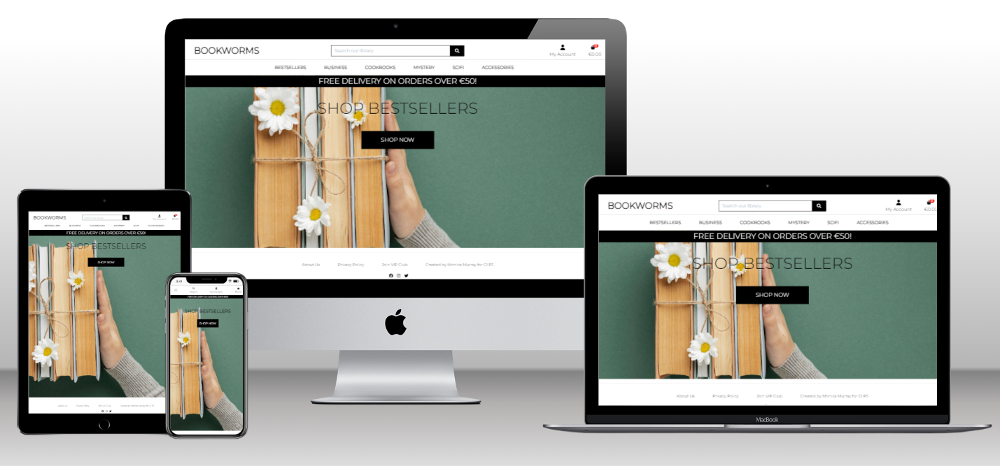 

An image of the finished site generated from [techsini](https://techsini.com/multi-mockup/index.php) which displays the application at four screen size breakpoints.

Please visit the live site via [this link](https://mym-bookworms-et-al-b7ea61e35a6e.herokuapp.com/).

## Purpose

The 'Bookworms et al' application is designed and build as a fictitious online presence of a physical bookshop, with the purpose of creating an online presence for the store to extend its customer reach. 

The design encourages users to browse and to make a purchase.

## Business Owner's Goals

The business owner's goal is to have a profitable eCommerce presence of its physical bookshop, which extends its customer base by providing an intuitive, robust and visually appealing website with secure and simple payment system.  The Store Owner wants to manage the product offerings of the eCommerce site securely, and add, edit or delete items via a secure interactive front-end.

## User/Customer's Goals

A customer of Bookworms et al wants to buy books.  They will understand the application's purpose when first arriving to the site, be able to navigate intuitively around the pages of the website, view all products, click on any product to view it in more detail, and be able to purchase one or many books securely.  A user or customer of this website may also want to be able to Register to create a user profile, and so can Login and Logout of their account on website, view and edit their personal data securely via their account, and view their purchase history.  All customer actions are met with feedback via the interactive front end to confirm their chosen action has been performed successfully or has been unsuccessful.

## Project Goal

Bookworms is my fifth and final Portfolio Project for Code Institute's Diploma in Full Stack Software Development (Ecommerce Applications) and is a Full Stack site based on business logic used to control a centrally-owned dataset.  

Bookworms et al contains an authentication mechanism and provides for the online, secure payment for products which are available and stored via the site's relational database.

## Business Model

Bookworms is a Business to Consumer (B2C) direct seller of books.

# CONTENTS

1. [User Experience(UX)](#ux)

2.  [Agile Methodologies](#agile)

3.  [Design](#design)

4.  [Features](#features)

5.  [Technologies](#technologies)

6. [Testing](#testing)

7. [Deployment](#deployment)

8. [Credits](#credits)

## User Experience (UX) Design

### Strategy

Our user is browsing for books, and wants an efficient, visually appealing, and secure means of book shopping. Being able to filter by genre and sort the product listing is a bonus. Website use is designed to be intuitive. Branding is clean, uncluttered, without distraction, but not sparse. The features are created with user ease of use in mind.

All interaction with the site is designed to produce a positive emotional response within the user. This is down to the flow of information layout, use of colour, clear and unambiguous navigation structures and user action feedback. There are no aggressive automatic pop-ups.  A user can control all actions and is shown a progress indicator and feedback on financial transactions.

### Scope

An intuitive simple, responsive online shopping experience with the following features is the Minimum Viable Product (MVP):

- responsive design,
- full-Stack website with an interactive front-end, a main navigation menu and a structured layout,
- a product structure contained within a cloud-hosted, relational database,
- secure authentication and role-based authorisation, 
- current login state is reflected to the user,
- secure ecommerce payment stystem, 
- user feedback system to report sucessful and unsuccessful actions,
- fully implemented CRUD - Create, Add, Update and Delete items from a secure front-end,

The six-week deadline is fixed and the timeline is tight.  MVP is priority. 

| Feature/Capability                                                                                 | Target                               |
| -------------------------------------------------------------------------------------------------- | ------------------------------------ |
| User Profile/My Account                                                                            | All Site Users                       |
| Payment Capability/ecommerce Payment System = Stripe                                               | All Site Users                       |
| Authentication and Authorisation                                                                   | Registered Users + Store Owner       |
| Form with validation for CRUD                                                                      | Store Owner                          |
| Secure access to authenticated views                                                               | Store Owner                          |
| Shopping Cart                                                                                      | All Shoppers, logged in or not       |
| Checkout                                                                                           | All Shoppers, logged in or not       |
|                                                                                                    |                                      |
| Feedback System                                                                                    |                                      |
|                                                                                                    |                                      |
| Implement a feedback system to report successful & unsuccessful activities - Interactive Front End | All Site Users                       |
|                                                                                                    |                                      |
| Main navigation menu                                                                               |                                      |
|                                                                                                    |                                      |
| View navbar items, navigate linked pages                                                           | All Site Users                       |
| Role-based User Registration and Login                                                             | Registered Users + Store Owner       |
| Restricted Content and Functionality                                                               | Registered Users + Store Owner       |
| Data Validation                                                                                    | Registered Users + Store Owner       |
|                                                                                                    |                                      |
| Search                                                                                             |                                      |
|                                                                                                    |                                      |
| Enter search criteria, view result                                                                 | All Site Users                       |
|                                                                                                    |                                      |
| Footer                                                                                             |                                      |
|                                                                                                    |                                      |
| View footer items, navigate all linked pages                                                       | All Site Users                       |
|                                                                                                    |                                      |
| Products - cloud hosted SQL database                                                               |                                      |
|                                                                                                    |                                      |
| Browse, View detail and Select                                                                     | All Shoppers, logged in or not       |
| Product CRUD                                                                                       | Store Owner                          |
|                                                                                                    |                                      |
| My Account/Profile                                                                                 |                                      |
|                                                                                                    |                                      |
| Register & Login                                                                                   | All Shoppers                         |
| View My Profile                                                                                    | Registered, authenticated users only |
| Edit/Update Profile data                                                                           | Registered, authenticated users only |
|                                                                                                    |                                      |
| Shopping Cart                                                                                      |                                      |
|                                                                                                    |                                      |
| View Shopping Cart, Add, Edit items                                                                | All Shoppers, logged in or not       |
|                                                                                                    |                                      |
| Checkout - Ecommerce payment system                                                                |                                      |
|                                                                                                    |                                      |
| View Checkout, Add shipping details,secure checkout                                                | All Shoppers, logged in or not       |
| Make Stripe Payments                                                                               | All Shoppers, logged in or not       |
|                                                                                                    |                                      |
| Email                                                                                              |                                      |
|                                                                                                    |                                      |
| Registration Confirmation                                                                          | All site users                       |
| Order Confirmation email                                                                           | All Shoppers, logged in or not       |
|                                                                                                    |                                      |
| Newsletter                                                                                         |                                      |
|                                                                                                    |                                      |
| View Signup page                                                                                   | All site users                       |
| Subscribe                                                                                          | All Site users                       |
|                                                                                                    |

### Structure

As is usual with an ecommerce business, a user of Bookworms is not required to be registered to browse and make a purchase.  However, greater convenience of use of the site comes with registration, for example a user's billing details and previous purchases are saved to their Profile when registered and can be edited on their Profile when they are logged in.  To ensure the security of the ecommerce business and its product offering, only Store Owner/Admin users will have access to the Product table and to its features and functionality following authenticated superuser login. 

User registration and login links are located on the Navigation bar. Successful login expands the Navigation bar to contain a 'Profile' page link for registered users, and if an authenticated user is a superuser, ie is the Store Owner, login returns 'Bookworms Store Management' link to add further products to the store.  In addition, the Store Owner can add, edit, and delete products from the main Products page to conveniently manage the product offering of the online store.

Search feature on the Navigation bar is available to all users.  

Logout feature's display is automatic following successful login and appears on Navigation bar to all logged in website users. Logout returns the site user to Home page.

The interactive footer contains internal links to the About Us and Privacy Policy pages.  It also contains a link to Bookworm's Newsletter VIP Club subscription form, and external links to the website's social media.

The functionality of Bookworms is a website with a cloud-based relational database to contain and manage the product offering, and which uses Stripe payment system to handle secure payments.  The data is stored in a consistent and well-organised manner on the database and any changes to the data is immediately available to the user at the front-end.

### Skeleton

This ecommerce website follows all the conventions followed by other online stores.  A user will be familiar with clicking on links and on icons to perform an action, with adding products to a Shopping Cart and with completing a Checkout process and card validation process to make a secure payment for a product or service.  This app will conform with all this convention.  All information displayed on the site is presented in an organised fashion with each piece of information being easy to find.  

### Surface

Colours will be crisp, clean, sophisticated. The colour palette generated is based on the home page and favicon image with soft greens and khaki tones.  Fonts will follow the clean, uncluttered scope with Montserrat chosen as it is easy to read on all devices.  The contrast between text and colour has been considered and colour choices made to optimise that contrast for screen reader and assistive technology.

A User's interaction with this responsive application should be simple and natural.  Use of links and icons will make actions intuitive. Efficient use of feedback messages will confirm successful and unsuccessful actions to the user at the front-end.

## Agile Methodology

Please follow this link to open my [AGILE.md](AGILE.md) file and read about how I used Agile Methodology in the planning and development of Bookworms et al application.

## Design

I began my design of the database structure by creating an Entity Relationship Diagram using LucidChart.com, which can be viewed [here](https://lucid.app/lucidchart/870086e4-1983-4c96-9b3f-d46d64402517/edit?page=0_0&invitationId=inv_c8206c6c-8a90-4b84-9056-0eba3ce0cab4#).  The Diagram planning and layout helped me to consider what to include in each Model and the relationships between the models of the database. 

### Colour Scheme

Bookworms' colour scheme is designed to be crisp, clean and sophisticated.  The colour palette is primarily black and white to optimise colour contrast.  

I used [Coolors](https://coolors.co) to generate a complimentary colour palette.

The colour palette is generated from the landing page image.

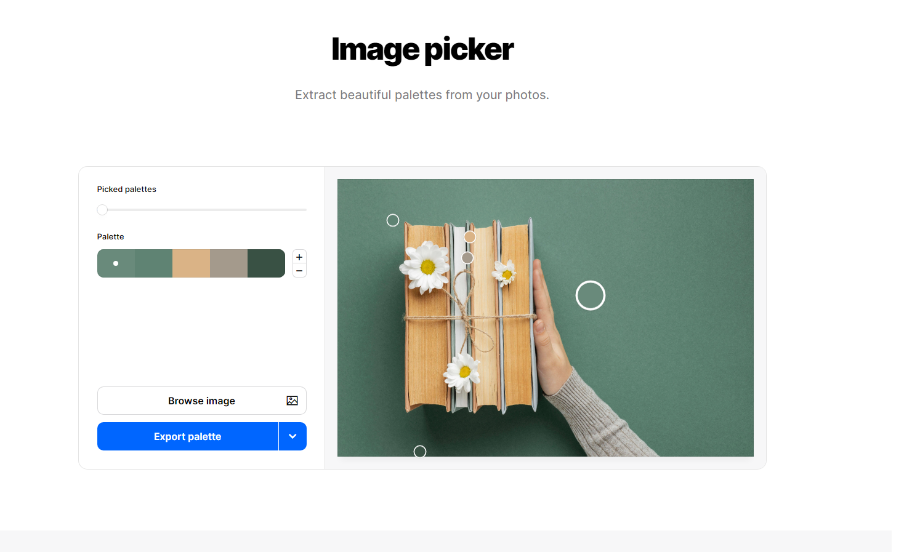
. 

### Typography

I chose Montserrat font from Google Fonts for my website.

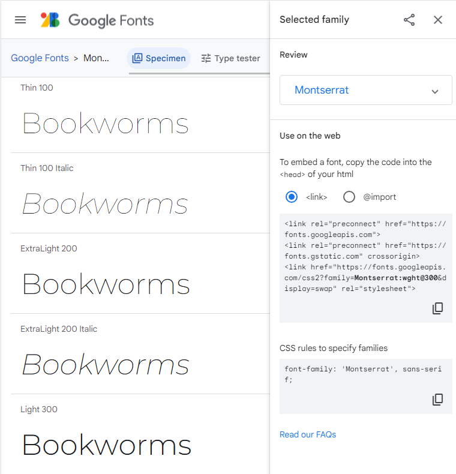

### Wireframes

I created my wireframes using [Figma.com](www.figma.com) to create the early UX Design Wireframe images.

| Page                                             | Desktop                                       | Mobile                   |
| ------------------------------------------------ | --------------------------------------------- | ------------------------ |
| Home Page                                        | [Homepage - Desktop wireframe](readme_media/wireframes/product_detail_desktop-store_owner_view.png)                        | [Homepage Mobile wireframe](readme_media/wireframes/product_detail_desktop-store_owner_view.png)    |
| Bestsellers/All Products Page                    | [Bestsellers - Desktop wireframe](readme_media/wireframes/bestsellers_desktop.png)                     | [Bestsellers - Mobile wireframe](readme_media/wireframes/bestsellers_mobile.png) |
| Bestsellers/All Products Page - Store Owner View | [Bestsellers - Desktop - Store Owner wireframe](readme_media/wireframes/bestsellers_desktop-store_owner_view.png)    |                          |
| Product detail Page                              | [Product detail - Desktop wireframe](readme_media/wireframes/product_detail_desktop.png)                  |                          |
| Product detail Page - Store Owner View           | [Product detail - Desktop - Store Owner wireframe](readme_media/wireframes/product_detail_desktop-store_owner_view.png) |                          |
| Profile Page                                     | [Profile - Desktop](readme_media/wireframes/profile_desktop.png)                         |                          |
| Shopping Cart                                    | [Shopping Cart wireframe](readme_media/wireframes/shopping_cart.png)                           |                          |
| Checkout                                         | [Checkout - Desktop wireframe](readme_media/wireframes/checkout_desktop.png)                        | [Checkout - Mobile wireframe](readme_media/wireframes/checkout_mobile.png)    |
| CRUD Add                                         | [Crud - Add_product wireframe](readme_media/wireframes/crud_add_product.png)                        |                          |
| CRUD Edit                                        | [Crud - Edit_product wireframe](readme_media/wireframes/crud_edit_product.png)                       |                          |
| Newsletter signup                                | [Newsletter signup](readme_media/wireframes/newsletter_signup.png)                       |                          |
| About Us                                         | [About us](readme_media/wireframes/about_us.png)                                |                          |
| Footer                                           | [Footer](readme_media/wireframes/footer.png)                                  |

### Favicon

A favicon appears in the browser tab with the website name as a visual reminder to enable a user to easily recognise and identify a company's website in a busy browser with many open tabs.  

The favicon for Bookworms is also the website's landing page image.  I chose this image from [freepik.com](www.freepik.com), saved it to my local machine, and used [favicon.io](https://favicon.io/) to download the image and generate the favicon files and the link tags to insert in the Head of my base.html.

### Database ERD

This section captures the cardinality between the entities, or tables, in the database, and how they relate to the functionality of the website itself.

The data model type used for this project is the Relational Model [list models] - User (allauth), Profile, Product, Category, Author, Order, OrderLineItem and Newsletter.

The Entity Relationship Model for the relational database was first created on paper and then a model designed using LucidChart.

[LucidChart](https://lucid.app/lucidchart/870086e4-1983-4c96-9b3f-d46d64402517/edit?page=0_0&invitationId=inv_c8206c6c-8a90-4b84-9056-0eba3ce0cab4#)

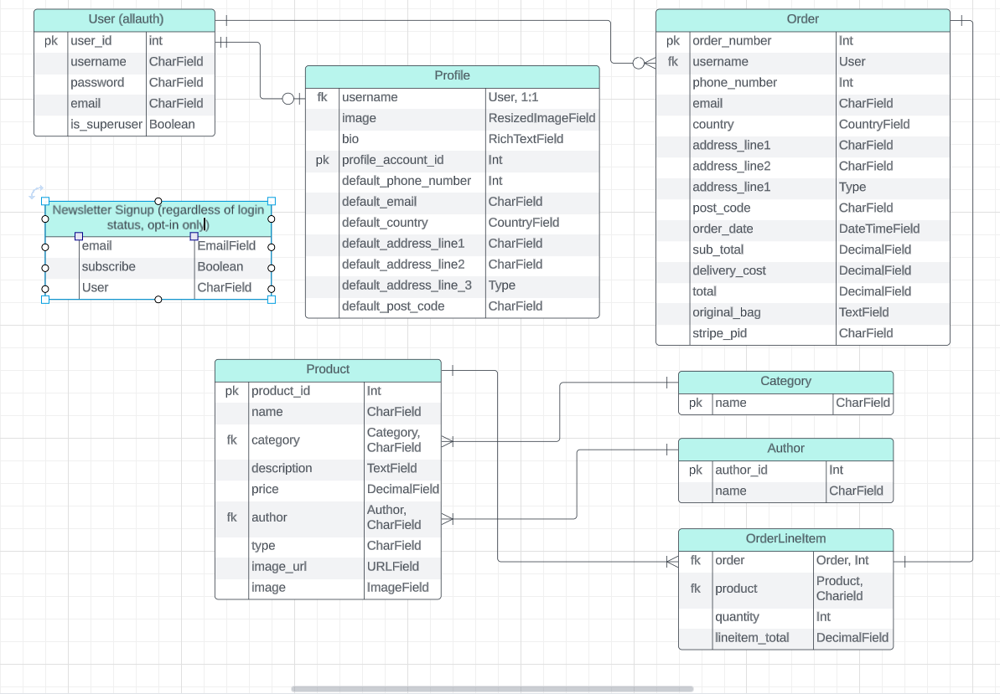

### Data Schema Planning

Using [LucidChart](https://lucid.app/lucidchart/870086e4-1983-4c96-9b3f-d46d64402517/edit?page=0_0&invitationId=inv_c8206c6c-8a90-4b84-9056-0eba3ce0cab4#) I set out the entities I needed in this Project, the attributes I required within each entity and then defined the relationships between the entities.  

## Features

#### Homepage

Bookworms home page is the primary web page that a visitor will view when they navigate to the website via a search engine, and it also functions as a redirection point following many of site's actions. It establishes Bookworms' brand and entices a visitor to delve deeper into the website.  Our home page contains one call to action, the 'Shop Now' button.

#### Registration/Authentication

Wikipedia defines website user registration and login as a function which "enables a system to personalize itself".  This personalisation is what offers users exclusivity, and convenience for a returning user. Our Bookworms website personalises the experience for a registered and logged in user by displaying a welcome message containing the user's name on login, and the Navigation content is changed to reflect the access level of the authenticated user. Bookworms allows a logged-in user to view and modify personal shipping details and previous purchase information.

#### Navigation 

The Navigation bar of Bookworms is designed to help a site user to move smoothly around the site, allowing users to navigate the layout of the site intuitively.  It is organised in a way to link the other pages of the website.  Our user can use the following functions with ease:

- Search bar function,
- My Account, which contains Registration and Login features to an unauthenticated user, or the Logout, Profile/Bookworms Store Management features to an authenticated user, with the content depending on their level of authentication,
- Shopping Cart and Checkout function,
- Category filtering feature.

The Navigation bar is available and offers the same functionality on each page of the website.

#### My Account

My Account is a tool designed for ease of use of the site user.  It also creates a sense of exclusivity for a user, with certain content only available to a logged in user. 

The My Account tool contains features for all users, be that Registration for an account, Login to an account, or when logged in changes to contain a link to the user's Profile and a Logout link to logout and preserve the user's secure content of the site.  It also provides a front-end means of managing the store's product offering for the Store Owner.

#### Shopping Cart

The shopping cart is for the site user to add products to for purchase.  

When a product is successfully added to the shopping cart a success message is displayed to the user giving a thumbnail view and synopsis of the product added.  It conveniently provides a total monetary value of the products in the shopping cart so the user can keep a running count of the cost of what they have added to the cart for purchase.

Within the shopping cart page, a user has additional functionality and can increase or decrease the quantity of the product they have selected to purchase, or remove it entirely, and can see the running total of their purchase update with every change they make.

The shopping cart contains a button link to the secure Checkout.

#### Checkout

A user can finalise their purchase of the products on this page.  They are required to add shipping details for their order, and securely add their card details.  The processing of the user's card is managed using Stripe secure payments system.  

On the checkout page, a user can opt-in to update their profile with their shipping details for speed of checkout on their next visit to the store.

#### Products

The products available for purchase on Bookworms are listed on this page and the page provides easy-to-use sorting and filtering options to help users find what they want within the product listings.

A product can be added directly to the shopping cart using the 'Add to My Cart' button function on each product.  Alternatively, a user can opt to open a product detail page for a product to view that offering in more details.

#### Product Detail

The product detail page outlines everything a user might wish to know about a product offered on Bookworms.  Product name, description, rating, price and a quantity picker are all features of this page.  A product can be added to the shopping cart, and the quantity of the product can be increased up to a maximum of 5 before the 'Add to My Cart' button is clicked.

#### CRUD

All of the major functions of the product management of the Bookworms store can be controlled by the authenticated Store Owner via the front-end on either the Products page or the Product detail page.  New products can be added, and existing product detail can be edited, or deleted from the store entirely, with all changes being reflected to the Store Owner on the front-end and to the data on the database.

#### User Feedback Messages

Feedback to all user interactions is provided via messages which appear from below the shopping cart icon.  A user can see their action has been performed successfully, and feedback in the event of an unsuccessful action is provided also, with a helpful message. A message can be dismissed by clicking the 'x' button on the top right corner of any feedback message.

#### Email Confirmation

Upon registering for an account on the Bookworms site, a user is sent a registration confirmation email and asked to verify their email address by clicking on the link issued to them in the confirmation email.  

On making a purchase, an order confirmation email is issued to a user which confirms all the detail of their purchase and the shipping address to which it will be sent.

#### Search Feature

Search feature, which is available to all site users, can be found in the Navigation bar and is used to search the website's content with convenience for the user in mind.  A user's search term is checked against product titles and descriptions, category names or author names and any matches found are returned to the front-end, with the number of the returned matches displayed over the list of those items.

#### Footer

The bespoke footer contains links to an 'About Us' page, the application's generated 'Privacy Policy', and an invitation to subscribe to 'Join VIP Club' to receive a newsletter.  The footer also contains a line of text "Made by Monica Murray for CI P4" with an external link to my GitHub profile, together with external links to the Facebook Business Page for Bookworms et al, and external links to Instagram and Twitter.

### Screenshots

TABLE 

404 Page

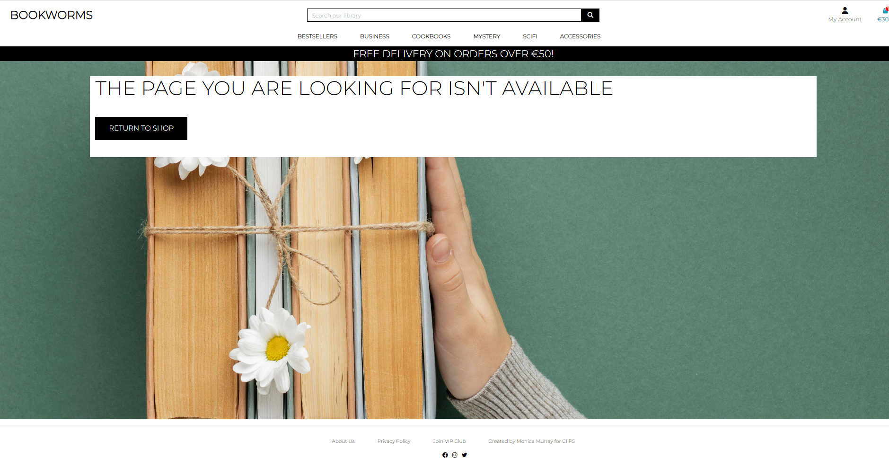

### Future Implementations

To be reviewed before submission

### Accessibility

Throughout this project I have endeavoured to implement good accessibility practices.  

- Semantic HTML is used throughout
- descriptive alt text attributes are used on all site images
- I have used [fontawesome](https://fontawesome.com/search?q=checkbox&o=r&m=free) icons in my application and to each icon I have added aria-labels to enable screen readers to understand them

I tested each site page on Lighthouse and [Wave](https://wave.webaim.org/) and improved my score further by implementing the following upgrades ...

Table

[The A11y Collective](https://www.a11y-collective.com/) is a useful site at which I saw why I was scoring poorly in relation to links on my application.

The CI a11y accessibility Slack channel is a useful and detailed resource which I will use earlier in my next project and post-Diploma.

## Technologies Used**

### Languages Used

Languages in this project were:

- Python, 
- HTML, 
- CSS,  and 
- JavaScript.

### Frameworks, Libraries & Programs Used

- Figma.com - Used to create wireframes.

- GitPod - The Cloud development environment used to develop the site.

- Google Fonts - To import the fonts used on the website.

- Google Developer Tools - To troubleshoot and test features, solve issues with responsiveness and styling.

- TinyPNG - To compress the Homepage image.

- Techsini To show the website image on a range of devices.

- Django framework and Bootstrap CSS library were both used in this project.

- Fontawesome - Used for icons.

- PostgreSQL database used to build the store product offering.

- Heroku and ElephantSQL - For deployment and Hosting of the project.

- GitHub - Distributed Version Control.

- GitHub Projects - Used to support the Agile development of the website.

- LucidChart - ERD Design and layout software.

- Favicon.io - Used to create the website favicon.

- Pillow - Installed to enable images to be viewed with the products in the models.

- Django Countries - Installed to use a drop-down list of Countries to choose from.

- Adobe Photoshop - Used on site images to optimise sizes.

- JQuery code library.

- Stripe payments system.

- Amazon Web Services (AWS) used to store the images for the website.

- SummerNote - Used to create a Rich Text Field for the user's biography.

- Boto3 - to connect Django to AWS and enable us store static files.
 
- Django-Storages - Used to connect Django to AWS.

## Defensive Programming

Defensive Programming was at the forefront of the site's development, with user authentication and authorisation implemented for all site users and limiting access to data to only the authenticated registered owner of that data.  In addition, Store Owner access is further restricted using the 'login_required' decorator with those front-end management views only rendering at the front-end to superusers.

## Marketing

In the planning of my eCommerce application, I asked myself the following three questions:

1. Which eCommerce application types apply to this online business.

- This is a Business to Customer eCommerce application type, selling physical products online.

2. With the eCommerce application type in mind, what kind of features might be included within the business website?
	
	- Easy Payment Gateway
	- Authentication System
	- Search + Filter functionality
	- High Quality images
    - Clear Product Descriptions
    - Ratings
    - Shopping Cart, Checkout and Payment System

3. What entities would your database need, and what data might be included in these entities?

| User (allauth) | Profile           | Products      | Category | Author  | Checkout: Order          | Checkout: OrderLineItem | Club          |
| -------------- | ----------------- | ------------- | -------- | ------- | ------------------------ | ----------------------- | ------------- |
| ID (pk)        | id (pk)           | id (pk)       | id (pk)  | id (pk) | order_number (pk)        | id                      | id            |
| username       | username ('User') | rating        | name     | name    | user_profile ('Profile') | order ('Order')         | user 		   |
| password       | image             | name          |          |         | full_name                | product ('Product')     | subscribe     |
| email          | bio               | category_name |          |         | email                    | quantity                | email 		   |
| is_superuser   | phonenumber       | description   |          |         | phone_number             | lineitem_total          |               |
|                | email             | price         |          |         | country                  |                         |               |
|                | country           | author        |          |         | town                     |                         |               |
|                | address line1     | type          |          |         | address line1            |                         |               |
|                | address line2     | image_url     |          |         | address line2            |                         |               |
|                | town              | image_url     |          |         | county                   |                         |               |
|                | postcode          |               |          |         | order_date               |                         |               |
|                | county            |               |          |         | delivery_cost            |                         |               |
|                |                   |               |          |         | order_total              |                         |               |
|                |                   |               |          |         | grand_total              |                         |               |
|                |                   |               |          |         | original_bag             |                         |               |
|                |                   |               |          |         | stripe_pid               |                         |               |
|                |                   |               |          |         |                          |                         |

- Plan the cardinality of the entities, asking what is the minimum or maximum number of attributes each entity can have with another entity, and establish any relationships between the entities clearly.

### Purpose of the Application

-The eCommerce aspect of the Bookworms et al business is specifically designed to facilitate commercial transactions, and it involves the online transfer of information.  As mentioned above, this is a Business to Customer eCommerce application type, selling physical products online.  Payments for those products is taken online.  The transaction is finished after a single payment is made and the product is shipped.

### Core Business Intents

The core business intent of Bookworms et al is to sell books online as a part of it's physical bookshop business, to extend it's market reach.

### Marketing Strategies for app

Content Marketing - consistently creating, distributing and promoting relevant online materials in a way that is strategically designed to attract and convert my target market into customers using Newsletters and Social Media Marketing:

#### Newsletters - VIP Club

Bookworms can provide additional benefit to Subscribers by providing regular interesting content related to bestsellers, author signings and readings and special offers.

- Newsletter subscription in this application is provided via a custom django app.  Any user, not just an authenticated user, may subscribe to receive a newsletter.  The subscription page is launched via a link in the footer.  Users may provide their name, but an email address is required in order to subscribe, and a user must opt-in to subscribe to comply with GDPR Regulations.  A user will receive feedback confirming their subscription, or in the event of an error there will be feedback inviting them to ensure the form is correctly filled in.

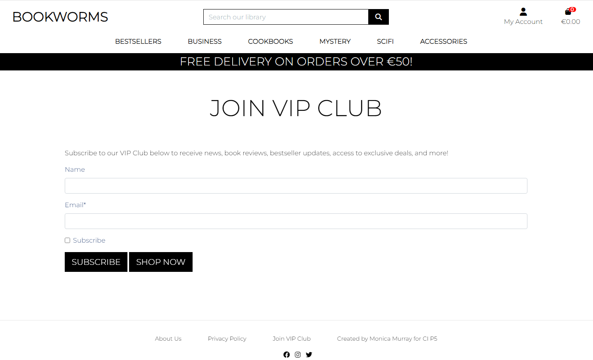

#### Social Media Marketing - Facebook business page

As Facebook has the largest number of users and the widest demographic, I chose to set up a [Facebook Business Page](https://www.facebook.com/profile.php?id=100094116007278) as part of the social media marketing strategy for Bookworms et al.

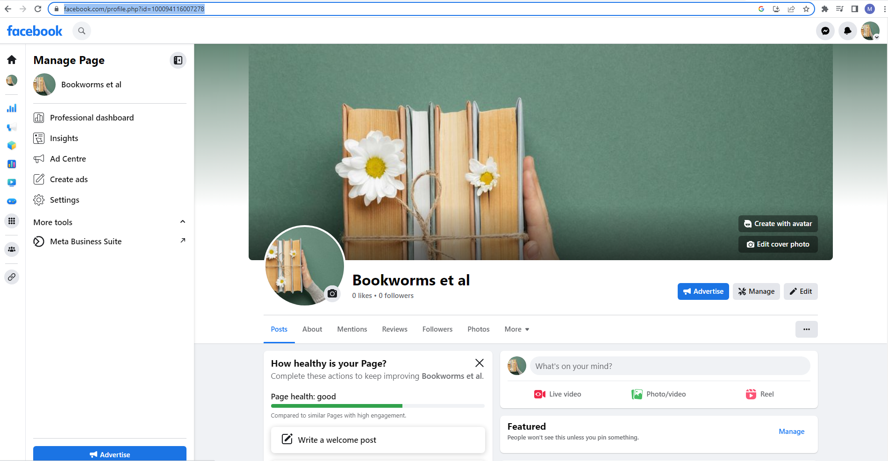

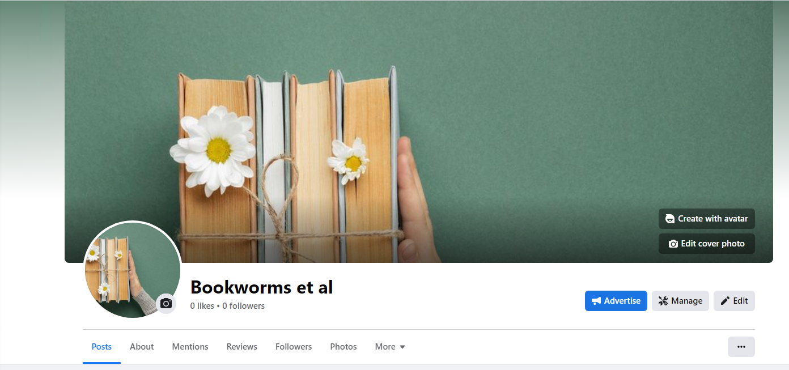
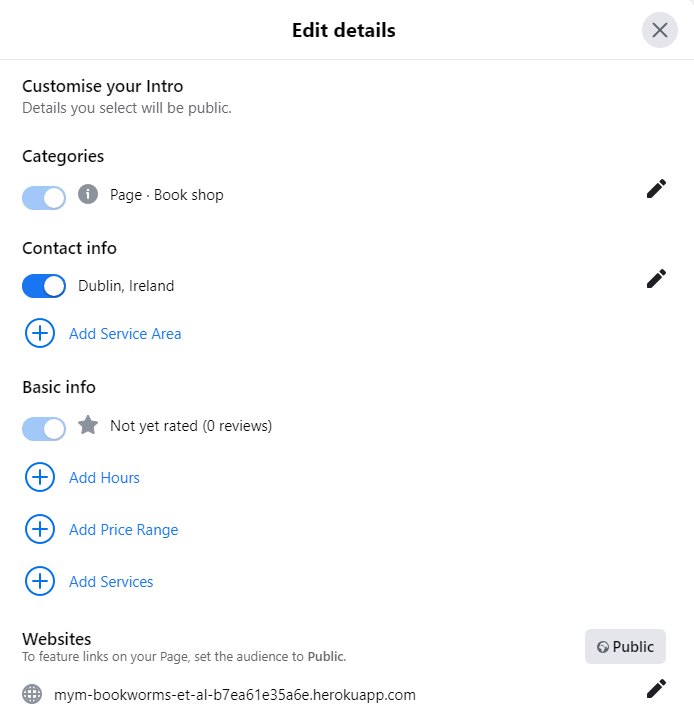
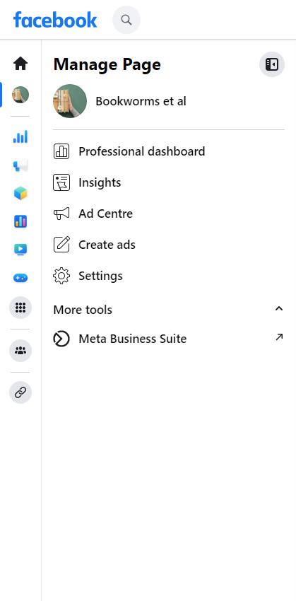
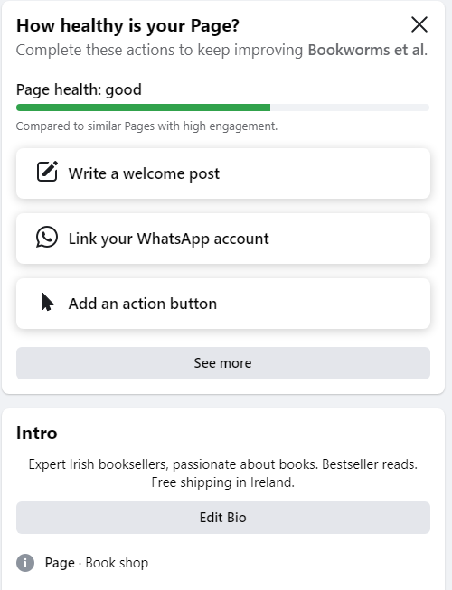
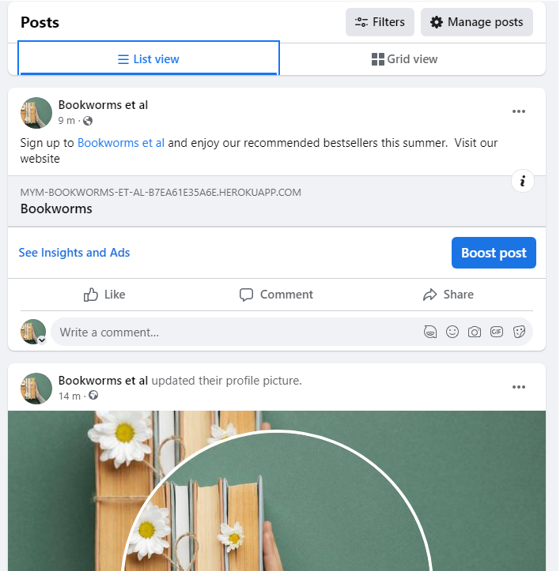

### SEO

After adding meta tags to my head element to optimize my website's visibility and improve search engine performance, I also added keywords to attract both search engines and users. I then added my deployed url to [XML-Sitmaps](www.xml-sitemaps.com) to generate an xml file.  Google uses this xml file to help it understand the website's structure and how the pages link to each other.

[Google Site Verification]()

The ideal keyword combination is to have long-tailed keywords with High Volume (lots of people using the keywords) but Low Competition (few other sites providing pages for your keywords).

The following table, based on Hubspot's SEO Starter Pack, helped me plan the SEO for Bookworms et al:

| Page           | Page Title                                             | Page Description                                                                                                                                                                                                                                                     | Target Keywords                                                                                                                | Internal LInks                                 | Call to Action                                                    |
| -------------- | ------------------------------------------------------ | -------------------------------------------------------------------------------------------------------------------------------------------------------------------------------------------------------------------------------------------------------------------- | ------------------------------------------------------------------------------------------------------------------------------ | ---------------------------------------------- | ----------------------------------------------------------------- |
| Home           | Bookworms + Home                                       | Bookworms et al are expert Irish booksellers. With Free shipping in Ireland, browse and purchase from our bestsellers in store or online. We are book-lovers, passionate readers and love recommending the right book for our customer. Shop our range now. | view our bestseller range of books, free shipping in Ireland with secure payment, book-lovers and readers, Irish-owned shop | Products                                       | Shop Now                                                          |
| Products       | Bookworms + Bestsellers                                | Bookworms et al offers secure and encrypted checkout powered by Stripe. Purchase from our range of bestseller books.                                                                                                                                              | view our bestseller range of books, free shipping in Ireland with secure payment, book-lovers and readers, Irish-owned shop | Product_Detail, Bag, Checkout                  | Add to My Cart                                                    |
| Product Detail | Bookworms + {product.name}                             | Bookworms et al's range are recommended by book-lovers and readers. With Free shipping in Ireland, browse and purchase from our bestsellers in store or online.                                                                                                   | view our bestseller range of books, free shipping in Ireland with secure payment, book-lovers and readers, Irish-owned shop | Products, Bag, Checkout                        | Update item quantity, Bestsellers/Keep Shopping, Add to My Cart   |
| Add Product    | Bookworms + Store Management - Add Product             | or Authorised Shop Owner only. Add a new book to Bookworms bookshop. Bookworms et al Irish bookshop, for all your bestseller reads.                                                                                                                                  | view our bestseller range of books, free shipping in Ireland with secure payment, book-lovers and readers, Irish-owned shop | Products, Bag, Checkout                        | Add Product, Cancel                                               |
| Edit Product   | Bookworms + Store Management - Edit {{ product.name }} | For Authorised Shop Owner only. Edit a product on Bookworms bookshop. Bookworms et al Irish bookshop, for all your bestseller reads.                                                                                                                              | view our bestseller range of books, free shipping in Ireland with secure payment, book-lovers and readers, Irish-owned shop | Products, Bag, Checkout                        | Edit Product, Cancel                                              |
| Shopping Bag   | Bookworms + Shopping Cart                              | Shopping Cart for Shop Bookworms                                                                                                                                                                                                                                     | view our bestseller range of books, free shipping in Ireland with secure payment, book-lovers and readers, Irish-owned shop | Products, Checkout                             | Update item quantity, Remove Item, Keep Shopping, Secure Checkout |
| Checkout       | Bookworms + Checkout                                   | Shop Bookworms payments processing is handled securely by Stripe ensuring your data is encrypted and protected                                                                                                                                                       | view our bestseller range of books, free shipping in Ireland with secure payment, book-lovers and readers, Irish-owned shop | Products, Product Detail, bag, Stripe, Profile | Save user data, Adjust Bag, Complete Order                        |
| Register       |                                                        |                                                                                                                                                                                                                                                                      | view our bestseller range of books, free shipping in Ireland with secure payment, book-lovers and readers, Irish-owned shop | Register, Login, Profile                       | Back to Login, Register                                           |
| Login          |                                                        |                                                                                                                                                                                                                                                                      | view our bestseller range of books, free shipping in Ireland with secure payment, book-lovers and readers, Irish-owned shop | Login, Home page, Profile                      | Login, Home page                                                  |
| Logout         |                                                        |                                                                                                                                                                                                                                                                      | view our bestseller range of books, free shipping in Ireland with secure payment, book-lovers and readers, Irish-owned shop | Logout, Login, Home page                       | Logout, Confirm logout, Cancel                                    |
| Profile        | Bookworms + {{user.username}}'s Account Profile        | Only for logged in users. Review your past orders, edit your details. Browse our range of bestsellers.                                                                                                                                                               | view our bestseller range of books, free shipping in Ireland with secure payment, book-lovers and readers, Irish-owned shop | Login, Home page, Profile, Order Number        | Edit details, Logout, Bestsellers/Keep Shopping                   |
| VIP Club       | Bookworms + Newsletter                                 | VIP Club for book, reviews, updates access to exclusive deals, and more. Shop Bookworms for recommended books.                                                                                                                                                       | view our bestseller range of books, free shipping in Ireland with secure payment, book-lovers and readers, Irish-owned shop | Home page, Register, Login, Profile            | Subscribe                                                         |
| Policy         | Bookworms + Privacy Policy                             | Here's everything you need to know about how we collect, store and manage our customers data. Shop Bookworms for all your holiday bestselling books                                                                                                                  | view our bestseller range of books, free shipping in Ireland with secure payment, book-lovers and readers, Irish-owned shop | Home page                                      | Bestsellers/Home page.                                            |
| About us       | Booworms + About Us                                    | Bookworms et al are expert Irish booksellers. With Free shipping in Ireland, browse and purchase from our bestsellers in store or online. We are book-lovers, passionate readers and love recommending the right book for our customer. Shop our range now. | view our bestseller range of books, free shipping in Ireland with secure payment, book-lovers and readers, Irish-owned shop | Home page                                      | Bestsellers/Home page.                                            |

#### Robots.txt and Sitemap.xml

- robots.txt is a simple text file that tells search engines where they are not allowed to go on the application.  In Bookworms, the robots.txt file is in the root directory and includes the admin, profiles and checkout directories as urls that the spiders are not permitted to access.

- sitemap.xml is a file that lists a website's import page urls, making sure that search engines can crawl, or navigate through them.  It helps a search engine to understand our website's structure and crawl every essential page on the website.  sitemap.xml was generated on [xml-sitemaps.com](https://www.xml-sitemaps.com/details-mym-bookworms-et-al-b7ea61e35a6e.herokuapp.com-49873d773.html) and is located in the root directory.

## Privacy Policy

A Privacy Policy, or Notice, is a document provided by the web application.  It's purpose is to be transparent and inform Bookworm's users about how their data is being collected and processed. 

It is concise, transparent and easily accessible via the footer on every page of the website.  This [Privacy Policy generator](https://www.privacypolicygenerator.info/live.php?token=6eM1Yk45QbpbJTg0NqgAfDfiFdgQoQgu) was used to generate the text content for this Bookworm et al's Privacy Policy.

## Testing

Testing is documented in TESTING.md file [here](TESTING.md)

## Deployment

- Prerequisites:

	- Heroku;
	- ElephantSQL;
	- Amazon AWS.

- Detail Forking, Cloning and Local Deployment of the repo

- Detail all Heroku app creation steps

- Detail the process, step by step, for connecting with AWS S3 Bucket creation

- Detail how to connect to Stripe

- Add an explanation of what env variables are, where to get them ie Django Secret Key is a 16-random-character key

The site is deployed using Heroku - [Bookworms et al](https://mym-bookworms-et-al-b7ea61e35a6e.herokuapp.com/)

### To Deploy the site using Heroku:

- Login (or signup) to Heroku;
- From the dashboard, click on 'New' and select 'Create New App';
- Populate the App Name field with your new Project or Application name, and select your local region ie. Europe. Click 'Create App' button.

The app is now created and is listed in the Heroku dashboard.

In the 'Settings' tab, add the Config Variables:

- DATABASE_URL: 'Paste ElephantSQL URL';
- SECRET_KEY: 'Paste in your secret key';
- PORT: 8000;

In the 'Deploy' tab:
- Select 'GitHub' from the Deployment method section;
- Connect to the GitHub repository for this project;
- Select 'Enable Automatic Deploys' from the the Automatic Deploy section.

### Create a new database on ElephantSQL

Heroku uses an ephemeral file system - which means it is wiped clean every time Heroku updates, or every time the app is redeployed.

So Gunicorn which will act as the web server for the project, and the project will also use a server-based database called 'Postgres'.  It will be seperated from the  application, so it will survive even if the application server is destroyed.

To Create the Postgres database:

- Login or signup to ElephantSQL;
- Click 'Create New Instance';
- Populate the 'Name' field with the name of the Project or Application;
- Leave the 'Plan' field with the pre-populated Tiny Turtle content;
- Leave the 'Tags' field blank;
- Click the 'Select Region' button and choose 'EU-West-1' as the local region;
- Click the 'Review' button, ensure all the content is correct, with the correct spelling, then click 'Create Instance'.

The Postgres database is now created on ElephantSQL and you can see it on your ElephantSQL dashboard. 

Connect Gitpod development environment to Postgres database

Through Gitpod, connect ElephantSQL through settings.py with a variable named 'DATABASE_URL', and then migrate the database structure to the newly connected ElephantSQL database.

Test the connection in ElephantSQL:

- Select the database instance from the dashboard;
- Select 'Browser' tab, then click on 'Table Queries'.

You should see that the dropped down list has been populated from the Django migrations.

### Create Procfile in Gitpod

Heroku needs a Procfile so it knows how to run a project.

In the newly created Procfile, add the line 'web: gunicorn PROJECTNAME.wsgi'.
 - 'web:' tells Heroku that this is a process that should accept http traffic;
 - 'gunicorn' is a web server installed for the project, a web services gateway server;
 - '.wsgi' stands for 'web services gateway server' and is the standard that allows Python services to integrate with web servers.

 The Project is now successfully deployed.
 .

### How to Fork

A Fork of a repository is a copy of the original repository that you now own. Any changes made to the project in your fork will not affect the original. 

Use the following steps: 

- Log in to GitHub and locate the repository Bookworms et al
- At the top of the Repository (not the top of the page) just above the "Settings" Button on the menu, locate and click the "Fork" Button.

You should now have a copy of the original repository in your GitHub account.

### How to Clone

Creating a clone enables you to make a copy of the repository at that point in time - this lets you run a copy of the project locally.

To do this, you should:

- Navigate to {insert the copied url here} 
- Click on the arrow on the green code button at the top of the list of files
- Select the 'Local' tab select the 'HTTPS' tab and click the icon to copy the prepopulated link
- Navigate to your code editor of choice and within the terminal change the directory to the location you want to clone the repository to.
- Type 'git clone' and paste the HTTPS link you copied from GitHub
- Press enter, the Forked repository will now clone to your preferred development method on your local machine.

## How Stripe Works - what's going on in the background

- When a website user launches the Checkout page from the Shopping Cart, the checkout/view.py will call out to Stripe and create a "Payment Intent" for the current amount in the Shopping Cart.

- When Stripe creates this payment intent, it will also have a secret that identifies it and when it is returned to the website, we send it to the template as the "client_secret" variable.

- Then, in the javascript, on the client side (our website) we call the confirmCartPayment method from Stripe javascript using hte client_secret which will verify our user's credit card number.

### Stripe Webhook

- A webhook from Stripe tells your application whether your customer's payment went through or not.

### Connect to Stripe

- 
- Finally, within 'Developers' click on the 'API keys' tab, copy the publishable and secret keys and add them to Heroku app via configvars keys.  Create a new webhook endpoint with the deployed app's name, enable it to 'Receive all events' and using the new webhook's signing secret key connect it to our Heroku app via a new configvar key.

### Connect to AWS

AWS is a cloud-based storage service which we use to store our media and static files for this project.

- Login, or create an account with aws.amazon.com.
- Select S3.
- Click on 'Create Bucket' to create a new storage bucket.
- Name the new bucket following the same naming convention as used when naming the Heroku app and the ElephantSQL database.  This bucket needs to be public in order to allow public access to the static files.
- When the bucket is created, use the 'Properties' and 'Permissions' tabs to set the bucket's settings.
- Create an Identify and Access Management (IAM) User Group into which we create the policy used to access our S3 bucket, and create a User to access the S3 bucket.  This static files user will have access keys which will be used to connect the bucket to our deployed app on Heroku via config var keys.
- Connect Django to S3 in AWS by installing two packages in the terminal, Boto and Django Storages, and add settings, via keys, to tell our project which bucket it should be communicating with.  These keys will be added to the Config Vars in Heroku.
- Tell Django that in production we want to use S3 to store our static files and our media files whenever someone runs collectstatic, and that we want any uploaded product images to go there also, all via custom classes in custom_storage.py.
- Finally, tell the browser to cache static files as they don't change very often, and this instruction will improve site speed and performance for the user.
- Create a Media folder within the S3 bucket into which we upload all images used in our project, and grant them public-read access.

## Credits

For my Project I followed the advice given in the [CI Guide to MVP video for Project 5](https://youtu.be/i7clFOYiwS0) to use the Boutique Ado Walkthrough Project code as a boilerplate to get started and save precious time, and I then customised as much as I could.  So full credit to Boutique Ado walkthrough which I have used extensively throughout this eCommerce project. 
 I also used the knowledge I learned from the design of both the 'Hello Django' and the 'Django Blog' Walkthrough projects during the CI Module on FST Frameworks. 

I found Dee Mc's YouTube videos on creating a [Django Recipe Sharing tutorial](https://www.youtube.com/watch?v=E9eWdZTpiGA&list=PLXuTq6OsqZjbCSfiLNb2f1FOs8viArjWy&index=4) useful to solidify what had been taught on the FSF Django module as she explained similar aspects in a different way that made sense to me. I found the video series on creating a [User Profile](https://www.youtube.com/watch?v=dGnRsNH81Ik&list=PLXuTq6OsqZjYSa-lrjd5wMGl23zpnhvln&index=2) particularly useful in creating my own Profile app in this project. The videos for creating a Favicon, Sitemap and Flex were also very helpful at different stages of this project's development.

I had used [SummerNote](https://djangocentral.com/integrating-summernote-in-django/) in [my fourth project](https://github.com/MoniMurray/shopping-list) and used it again in this Bookworms project.

Favicon  - the image I chose, which states it requires crediting or I’ll be charged, comes from [Freepik.com]](Www.freepik.com).  The Image is by <a href="https://www.freepik.com/free-photo/creative-composition-with-books-flower_12407755.htm#query=book&position=21&from_view=keyword&track=sph">Freepik</a>

I used the website [Tinypng](https://tinypng.com/) to reduce the size of my homepage image.

Credit to the many [CI Community Q&A videos](https://www.youtube.com/playlist?list=PL_7334VduOHsrWzhu5Ta2lrkp016kcBWYvideos) for advice from MVP of Project 5, to how to study, to very valuable videos on Readme essential sections.

Credit to [this Stack Overflow post](https://stackoverflow.com/questions/29313879/shopping-cart-number-of-items-in-cart-css) from which I learned to apply a counter to the Shopping Cart icon on the nav bar.

I took inspiration for the design of the Bookworms et al Bookshop from many leading Irish bookshops with strong online presence such as Easons and Dubray.

To fix my footer to the bottom of every page, regardless of body content size, I used [flex](https://dev.to/nehalahmadkhan/how-to-make-footer-stick-to-bottom-of-web-page-3i14) as outlined on this article.

The [PyLessons](https://pylessons.com/django-subscribe) article about Newsletter subscriptions helped me to lay out the model for my own custom newsletter subscription in this project.

Bug fixing my search function took a little further research into how to structure a search in Django and the following [YouTube video](https://www.youtube.com/watch?v=AGtae4L5BbI&pp=ygUec2VhcmNoIHByb2R1Y3RzIGZlYXR1cmUgZGphbmdv) helped me to formulate the search and structure the view, in particular the author and category queries which needed double underscores to search in the name field of the author and category foreignkeys of Product model.

I used [Wikipedia](https://en.wikipedia.org/wiki/Registered_user#:~:text=User%20registration%20and%20login%20enables,preferences%20indicated%20by%20the%20user.) to define features of a website, such as Registration and Login.

All wireframes, ERD and screenshots are my own creation.  This Readme is based on the extensive Readme.md file I created for my PP4, [The Shopping List](https://github.com/MoniMurray/shopping-list)

### Acknowledgments

The CI Slack Community is a resource I used almost as much as Google for this project! This community is so kind and generous with their collective and individual knowlege and I used them to bounce ideas off, ask for advice, and to seek guidance where code went awry.  A Big thank you to CI colleagues for taking the time to thoroughly test the site for me.

CI Tutor Support were an invaluable resource for this project and I'm so grateful to all the patient Tutors from whom I received a huge amount of reasurance and guidance.

Thanks to my mentor Jubril Akolade for all his encouragement!

